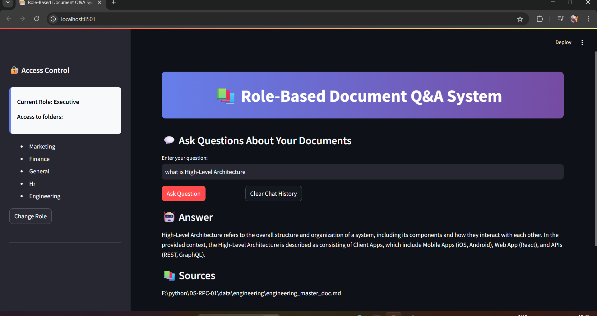

# 📚 Role-Based Document Q&A System

This project is a **Role-Based Document Question-Answering System** built using **LangChain**, **Groq LLM**, and **Streamlit**. It enables employees to query internal documents based on their job roles with access restrictions, leveraging Retrieval-Augmented Generation (RAG). 

> 💡 This project is inspired by and based on a case study provided by the [Codebasics](https://www.youtube.com/@codebasics) team. Credit goes to them for the concept and dataset structure.

---

## 🔍 Project Overview

This system uses a combination of:

- 🧠 **Large Language Models (LLMs)** via [Groq](https://groq.com/)
- 📚 **LangChain** for Retrieval-Augmented Generation
- 📂 **Chroma/FAISS vector databases** for storing and retrieving document embeddings
- 📄 Role-based access to documents
- 🌐 **Streamlit** for a user-friendly web interface

Employees can only view and query documents related to their role. For example:

| Role        | Accessible Folders                       |
|-------------|------------------------------------------|
| Finance     | finance, marketing, general              |
| Marketing   | marketing                                |
| HR          | hr                                       |
| Engineering | engineering                              |
| Executive   | All folders                              |
| Employee    | general                                  |

---

## 🧠 How It Works

1. **Document Access Control**: Based on role selection, only allowed folders are loaded.
2. **Document Processing**: Documents are split and embedded using `sentence-transformers/all-MiniLM-L6-v2`.
3. **Vector Store**: Documents are stored in a Chroma vector DB for fast semantic retrieval.
4. **Q&A**: Queries are passed through a LangChain QA chain that fetches relevant documents and generates answers using the Groq LLM.
5. **Streamlit App**: Users can interactively set roles, view accessible documents, and chat with the Q&A system.

---

## 🗂️ Folder Structure

```
├── app.py                # Streamlit UI
├── rag1.py               # RAG pipeline (initialization, loading, processing, answering)
├── resources/vectorstore # Chroma vector store files
├── data/                 # Role-based document folders (e.g., finance/, hr/, general/)
```

---

## 🚀 Getting Started

### 1. Clone the Repository

```bash
git clone https://github.com/kaze-ally/Role-based-chatbot.git
cd Role-based-chatbot
```

### 2. Install Requirements

```bash
pip install -r requirements.txt
```

### 3. Set Environment Variables

Create a `.env` file with your **Groq API key**:

```
GROQ_API_KEY=your_groq_api_key_here
```

### 4. Prepare Your Data

Create the following folder structure under `data/` and add your `.md` or `.csv` files:

```
data/
├── finance/
├── marketing/
├── general/
├── hr/
├── engineering/
```

Each folder should contain documents accessible by the respective roles.

### 5. Run the Application

```bash
streamlit run app.py
```

---

## ✅ Features

- Role-based document access control
- Embedding using `sentence-transformers`
- Streamlit interface with chat history
- QA using Groq's LLM + LangChain
- Easy to extend with new roles or documents

---

## 📦 Dependencies

See [`requirements.txt`](#requirements.txt) for all required libraries.

---

## Screenshot of the Streamlit app:



## 🙏 Acknowledgements

This project is based on a role-based RAG assignment by **[Codebasics](https://www.youtube.com/@codebasics)**. Special thanks to them for curating such real-world case studies to learn from.

---

## 📜 License

This project is for educational purposes only and follows fair use of Codebasics materials.


